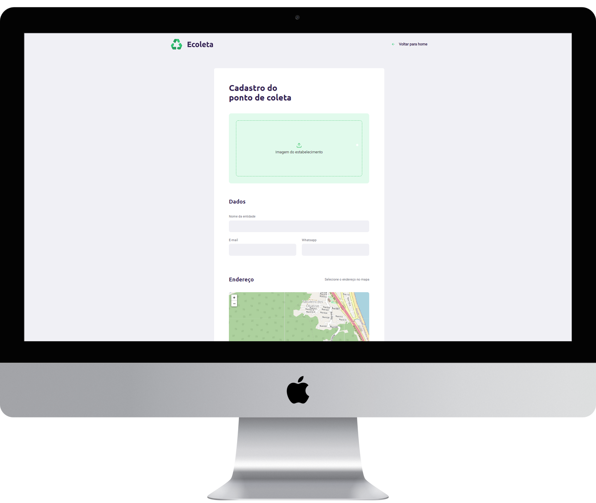

<h1 align="center">
    
</h1>

<h4 align="center">
  🚀 Next Level Week 01 by Rocketseat
</h4>

  
  

## 📱 Interfaces

A interface web conta com 2 interfaces, sendo elas a página inicial e a outra uma interface para cadastro de pontos de coleta. O interessante dessa pagína de cadastro de pontos é que nela foi utilizada funcionalidade de mapa para pegar a posição do ponto de coleta;

    

## 🔄 Executar

- Entrar na pasta `frontend`;
- Executar `yarn install` para instalar dependências do projeto;
- Executar `yarn start` para que o projeto seja executado;

## 📝 Licença

Este projeto está sobre a licença MIT. Veja o arquivo [LICENSE](../LICENSE.md) para mais detalhes.

---

<h4 align="center">
  Feito com ❤️ by Gustavo Souza
</h4>
