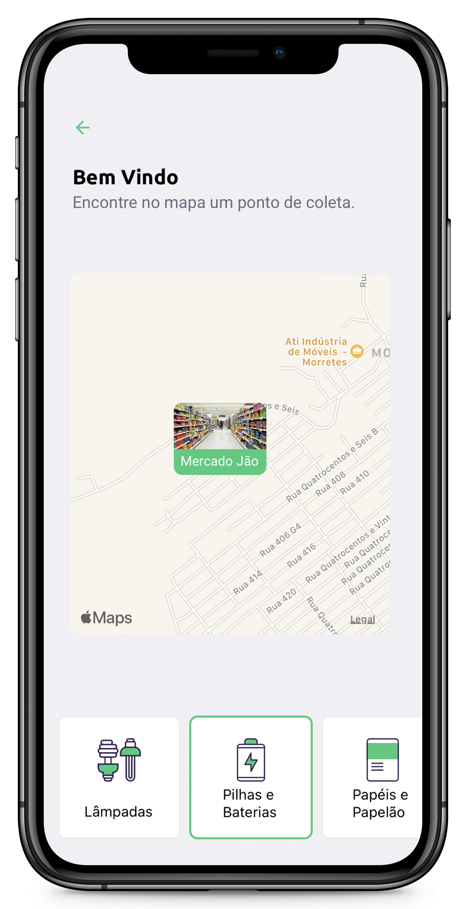

<h1 align="center">
    
</h1>

<h4 align="center">
  🚀 Next Level Week 01 by Rocketseat
</h4>

  
  

## 📱 Interfaces

O aplicativo mobile é composto por 3 interfaces, sendo elas: Uma para login, outra para buscar os pontos de parada e outra para ver os detalhes de um ponto de parada especifico. Incluí uma link para whatsapp e e-mail que fazem link direto para os apps do celular do usuário;

    

## 🔄 Executar

- Entrar na pasta `mobile`;
- Executar `yarn install` para instalar dependências do projeto;
- Executar `yarn start` para que o projeto seja executado;

## 📝 Licença

Este projeto está sobre a licença MIT. Veja o arquivo [LICENSE](../LICENSE.md) para mais detalhes.

---

<h4 align="center">
  Feito com ❤️ by Gustavo Souza
</h4>
